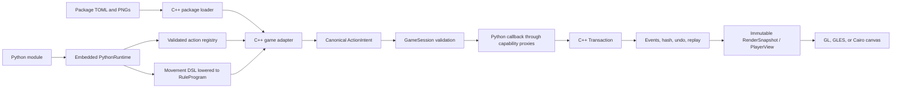

# Package authoring and C++/Python integration

This tutorial explains how to create Ludus Arcanum packages, how package files are
validated, and exactly where Python ends and the C++ engine begins. It covers both
authoring paths supported by the repository:

1. **Studio packages** are editable `.ludus` directories. Today they can describe and
   preview bounded rectangular boards, import visual assets, and playtest chess-like
   8×8 variations by changing Python movement declarations and transactional effects.
2. **Native game packages** add a C++ adapter when a game needs a different topology,
   legality model, action vocabulary, scenario loader, AI, or specialized presentation.
   Python can still provide declarative movement and trusted effect callbacks.

The two built-in examples demonstrate both ends of the spectrum:

- `games/orthodox_chess` combines a native orthodox legality model with Python-authored
  traversal declarations and a transactional `chess_move` callback.
- `games/tactical_rpg` owns tactical legality, LOS, initiative, objectives, and AI in
  C++, while Python resolves deterministic combat effects through the same transaction
  boundary.

## 1. The authority model

Ludus Arcanum does not expose mutable C++ state directly to Python. C++ owns the
authoritative state, stable IDs, topology, legal-action validation, random streams,
history, saves, hashes, and replay. Python receives a short-lived read capability and a
controlled transaction capability only while an accepted action is resolving.



This division has practical consequences:

- A Python callback cannot invent handles, mutate the entity store directly, access the
  renderer, or keep a usable context after it returns.
- C++ validates and canonicalizes an action before Python sees it.
- Every Python mutation becomes a typed C++ event in one atomic transaction.
- A Python exception rejects the complete transaction and restores state and random
  streams.
- Rendering and presentation never call Python and never affect authoritative hashes.
- Package Python is trusted code, not a security sandbox. Only load packages you trust.

## 2. Build the authoring environment

On Ubuntu 24.04, install the dependencies and build the GUI configuration:

```bash
sudo apt update
sudo apt install build-essential cmake ninja-build pkg-config python3-dev python3-venv \
    catch2 clang-format libgtkmm-4.0-dev libepoxy-dev libpng-dev

cmake --preset gui
cmake --build --preset gui
ctest --preset gui
```

Start Studio:

```bash
./build/gui/ludus-studio
```

For Python SDK tests, create the development environment once:

```bash
python3 -m venv build/dev/pytest-venv
build/dev/pytest-venv/bin/python -m pip install -r requirements-dev.txt
```

## 3. Create a first Studio package

This example creates a chess variation in which rooks move only one orthogonal square.
It retains orthodox turn order, checks, castling, pawn rules, promotion, save behavior,
and replay because those remain in the native chess adapter.

1. Start `ludus-studio`.
2. Set **Package directory** to an unused directory such as
   `/tmp/short-rook.ludus`.
3. Set **ID** to `org.example.short-rook`.
4. Choose **New**. Studio creates and atomically saves a complete 8×8 package.
5. Open the `scripts/game.py` tab.
6. Replace the `rook` movement declaration as shown below.
7. Choose **Save**, then **Playtest**.

The generated package has this layout:

```text
short-rook.ludus/
├── game.toml
├── assets/
├── visuals/
│   └── theme.toml          # created when the first PNG is imported
├── boards/
│   └── primary.board.toml
└── scripts/
    ├── __init__.py
    └── game.py
```

Change only the rook entry in `MOVEMENT_RULES`:

```python
MOVEMENT_RULES = {
    "rook": move.jumps(ORTHOGONAL).allow_empty().capture_enemy(),
    "bishop": move.rays(DIAGONAL).until_blocked().allow_empty().capture_enemy(),
    "queen": move.rays(ADJACENT).until_blocked().allow_empty().capture_enemy(),
    "king": move.jumps(ADJACENT).allow_empty().capture_enemy(),
    "knight": move.jumps(KNIGHT).allow_empty().capture_enemy(),
}
```

While playtesting, change the source back to a ray, save it, and choose **Reload rules**.
Studio compiles and validates the complete candidate rule set at a safe simulation
boundary. A valid replacement becomes active without changing the current state hash.
A syntax error, missing rule, or invalid direction leaves the previous generation
active and produces a source-located diagnostic.

## 4. Understand `game.toml`

Studio packages use `game.toml` as their editable manifest:

```toml
[package]
id = "org.example.short-rook"
version = "0.1.0"
engine_api = ">=0.1.0,<0.2.0"
entry_point = "scripts.game"
board = "boards/primary.board.toml"
save_compatibility = 1
assets = []
permissions = []
dependencies = []

[native]
extensions = []
enabled_by_default = false
```

The fields mean:

| Field | Meaning and current constraints |
|---|---|
| `id` | Stable dotted package ID. Segments may contain letters, digits, `_`, and `-`, but cannot start with a digit. |
| `version` | Numeric semantic version in `major.minor.patch` form. Prerelease suffixes are not accepted yet. |
| `engine_api` | Currently `0.1.0` or `>=0.1.0,<0.2.0`. |
| `entry_point` | Dotted Python module. `scripts.game` resolves to `scripts/game.py` inside the package. |
| `board` | Canonical relative path to the board TOML file. Absolute paths and `..` are rejected. |
| `visuals` | Optional relative path to a theme, normally `visuals/theme.toml`. |
| `save_compatibility` | Positive package-owned compatibility generation. Increase it only when intentionally changing authoritative save semantics and provide migration support. |
| `assets` | Allowlist of every PNG referenced by the theme. A file merely existing under `assets/` is not enough. |
| `permissions` | Reserved package capability declarations. Built-in packages currently request none. |
| `dependencies` | Package IDs required by the package. IDs are validated; dependency installation/resolution is not an authoring shortcut. |
| `extensions` | Relative native extension paths. Editable packages should leave this empty. |
| `enabled_by_default` | Must be `false`; native code is never silently enabled by a package. |

Manifest and other package text files are bounded to 1 MiB. Paths are resolved inside
the canonical package root, and escaping symlinks are rejected by the asset layer.

Built-in engine-integrated games use `package.toml` because their C++ adapters own
scenario construction rather than `PackageDocument`. Their visual catalogs use the
same `visuals` and `assets` records. Do not rename a Studio `game.toml` to
`package.toml`; they serve related but distinct loading paths today.

## 5. Define a board

Studio writes `boards/primary.board.toml`:

```toml
[board]
kind = "rectangular"
width = 8
height = 8
side_to_move = 0
castling_rights = 15

[[entity]]
name = "white_rook_a"
type = "rook"
owner = 0
x = 0
y = 0
sprite_name = "piece.ivory.rook"

[[entity]]
name = "black_king_e"
type = "king"
owner = 1
x = 4
y = 7
sprite_name = "piece.iron.king"
```

Board rules enforced by `PackageDocument` include:

- only `rectangular` boards are accepted by the current document format;
- each dimension is 1–256, with at most 65,536 total spaces;
- at most 65,536 entities are allowed;
- entity names and types are identifiers and names must be unique;
- no two document entities may occupy one coordinate;
- coordinates must be inside the board;
- named sprites are dotted identifiers; legacy numeric sprites remain readable but are
  upgraded to names on save where possible.

`side_to_move` is `0` or `1`. The chess template uses castling bits `1`, `2`, `4`, and
`8` for white king-side, white queen-side, black king-side, and black queen-side.

The topology editor can preview any accepted rectangular dimensions. The current
interactive Studio playtest adapter is deliberately narrower: it requires an 8×8 board,
owners `0` and `1`, exactly one king for each side, and entity types `pawn`, `knight`,
`bishop`, `rook`, `queen`, or `king`. Use a native adapter for a different game model.

## 6. Author movement in Python

The SDK exposes immutable movement declarations:

```python
from ludus_arcanum import move

ORTHOGONAL = ("north", "east", "south", "west")

rook = (
    move.rays(ORTHOGONAL, max_steps=0)
    .until_blocked()
    .allow_empty()
    .capture_enemy()
)

leaper = (
    move.jumps(("north", "south"), distance=2)
    .allow_empty()
    .capture_enemy()
)
```

`move.rays(...)` traverses each named direction. `max_steps=0` means that the declared
distance itself is unbounded; topology edges and blockers still bound evaluation.
`until_blocked()` stops a ray at occupancy. `allow_empty()` emits empty destinations,
and `capture_enemy()` emits destinations occupied by an opponent. `move.jumps(...)`
checks only its landing space and requires a positive distance.

The objects are frozen dataclasses. Each modifier returns a new value, so module import
produces deterministic declarations without retaining simulation state.

At load or reload, C++ resolves every direction string through the game adapter's
`SymbolRegistry`, converts the declaration to a `MovementRuleGraph`, validates it, and
lowers it to a compact `RuleProgram`. Programs are limited to 32 instructions and 64
directions and have canonical bytes and hashes.

For the current chess-like adapter, `MOVEMENT_RULES` must contain `rook`, `bishop`,
`queen`, `king`, and `knight`. Pawn movement, check legality, castling, en passant, and
promotion remain native. The adapter intersects native orthodox legal moves with these
programs, so a Python movement declaration can restrict this chess-like ruleset but
cannot expand it beyond moves accepted by the C++ position model.

## 7. Resolve an action in Python

Actions are registered with `@action`. The decorator creates the module's validated
`__ludus_actions__` registry:

```python
from ludus_arcanum import action

@action("resolve_attack")
def resolve_attack(ctx, tx, actor, targets):
    target = targets[0]
    rolled = tx.roll("1d6+1", "combat")
    attack = ctx.property(actor, "attack")
    armor = ctx.property(target, "armor")
    damage = max(1, rolled.total + attack - armor)
    health = ctx.property(target, "health")
    tx.set_property(target, "health", max(0, health - damage))
```

Callbacks must accept `(ctx, tx, actor, targets)` and return `None`. Duplicate action
names fail during import. The C++ adapter decides when the callback is invoked and which
canonical targets and arguments it receives.

### Read-only `RuleContext`

| API | Result |
|---|---|
| `ctx.action`, `ctx.issuer`, `ctx.actor`, `ctx.targets` | The canonical `ActionIntent` expressed as typed handles. |
| `ctx.entity(entity)` | Snapshot with `location`, `owner`, and numeric `tag_ids`. |
| `ctx.entities_at(space)` | Stable entity handles currently on a space. |
| `ctx.neighbors(space, direction)` | Outgoing neighbors for an interned direction name. |
| `ctx.property(entity, name)` | `bool`, `int`, `str`, or `None` for an interned property. |
| `ctx.has_tag(entity, name)` | Whether an entity has an interned tag. |
| `ctx.argument(name)` | Canonical action argument supplied by C++. |
| `ctx.evaluate_movement(actor, program)` | Native movement candidates for a compiled program. |

### Mutable `Transaction`

| API | Authoritative effect |
|---|---|
| `tx.move(entity, destination)` | Moves an entity, or removes it from the board with `None`. |
| `tx.destroy(entity)` | Destroys an entity and invalidates its generation. |
| `tx.set_owner(entity, owner)` | Changes or clears ownership. |
| `tx.spawn(location, owner, tags, properties)` | Creates an entity and returns its engine-issued handle. |
| `tx.set_property(entity, name, value)` | Sets a `bool`, signed integer, or string property. |
| `tx.erase_property(entity, name)` | Removes a property. |
| `tx.add_tag(...)`, `tx.remove_tag(...)` | Changes an interned tag. |
| `tx.roll(expression, stream)` | Uses the engine-owned deterministic random stream and records the dice event. |

Every direction, property, tag, and action name used by Python must first be interned by
the C++ adapter. A misspelling becomes a `KeyError` and rejects the transaction rather
than creating an unstable symbol at runtime.

Do not store authoritative state in Python globals. Module globals are neither saved nor
hashed. Store persistent values as entity properties/tags through `tx`, or model them in
the native game state. Do not use `random`, system time, filesystem state, or network
responses in resolution. Use `tx.roll` for replayable randomness.

Handles and capabilities are intentionally constrained:

- `EntityHandle`, `SpaceHandle`, `PlayerHandle`, and `ActionHandle` cannot be forged by
  ordinary package code;
- entity and space handles include an index and generation, so stale handles fail;
- `ctx` and `tx` expire immediately after the callback returns;
- retaining either object and using it later raises an expired-capability error.

## 8. The generated chess transaction

The Studio template registers one action named `chess_move`. C++ first proves that a
move is legal, expands it into canonical targets and metadata, and then calls Python.
Python performs only the accepted state transition:

```python
CAPTURE = 1 << 0
KING_CASTLE = 1 << 3
QUEEN_CASTLE = 1 << 4
PROMOTION = 1 << 5

@action("chess_move")
def chess_move(ctx, tx, actor, targets):
    flags = ctx.argument("move_flags")
    cursor = 2

    if flags & CAPTURE:
        tx.destroy(targets[cursor])
        cursor += 1

    tx.move(actor, targets[0])

    if flags & (KING_CASTLE | QUEEN_CASTLE):
        tx.move(targets[cursor], targets[cursor + 1])

    if flags & PROMOTION:
        tx.set_property(actor, "piece_type", ctx.argument("promotion"))

    metadata = targets[1]
    tx.set_property(metadata, "side_to_move", ctx.argument("next_side"))
    tx.set_property(metadata, "castling_rights", ctx.argument("next_castling"))
    tx.set_property(metadata, "en_passant", ctx.argument("next_en_passant"))
    tx.set_property(metadata, "halfmove_clock", ctx.argument("next_halfmove"))
    tx.set_property(metadata, "fullmove_number", ctx.argument("next_fullmove"))
```

If any operation fails, or if the function raises, the destructor/commit path rolls back
all state patches and restores the random snapshot. No partial capture or half-applied
castle can escape.

## 9. Add package-native visuals

Studio's **Visual assets** inspector imports a PNG through a collision-safe atomic write,
adds it to the manifest allowlist, creates or updates `visuals/theme.toml`, and refreshes
the preview only after the complete candidate theme validates.

A minimal hand-authored theme looks like this:

```toml
[theme]
id = "short-rook"
display_name = "Short Rook"
font_families = ["Cinzel", "Serif"]
background = "#0b0e16ff"

[[color]]
id = "interaction.selection"
value = "#e9b94fff"

[[sprite]]
id = "piece.custom.rook"
source = "assets/custom-rook.png"
pivot_x = 0.5
pivot_y = 0.84
world_width = 0.84
world_height = 1.08
filter = "linear"

[[animation]]
id = "piece.custom.rook.idle"
frames = ["piece.custom.rook"]
frame_ms = 160
loop = true
```

Then declare both the theme and asset in `game.toml`:

```toml
visuals = "visuals/theme.toml"
assets = ["assets/custom-rook.png"]
```

Sprite-sheet entries may add all four of `region_x`, `region_y`, `region_width`, and
`region_height`. Omitting one region field rejects the theme. Use `nearest` filtering
for deliberate pixel art and `linear` for ordinary transparent artwork.

Current visual limits are intentionally bounded:

- 1,024 declared assets/sprites and 128 named colors;
- 16 MiB compressed and 4,096×4,096 pixels per PNG;
- 64 million decoded pixels per theme;
- up to 16 atlas pages of 4,096×4,096;
- pivots in `[0, 1]`, world dimensions in `(0, 64]`;
- animation frame duration from 1 to 60,000 ms;
- up to eight preferred system font families.

PNG is the supported package image format. The loader preserves alpha, converts atlas
content to premultiplied sRGB-aware RGBA, extrudes padding to avoid sampling bleed, and
packs sprites deterministically. PPM exists only for legacy compatibility tests.

Theme loading validates canonical containment, symlink containment, the manifest
allowlist, duplicate names/paths, missing animation frames, finite numeric values, PNG
integrity, dimensions, and atlas capacity. Hot reload keeps the last valid catalog if a
candidate fails.

## 10. Debug and playtest a Studio package

Studio exposes three useful read-only views while a playtest is active:

- **Diagnostics** contains validation failures and Python tracebacks with source paths
  and line numbers.
- **Event log** shows the typed events committed by each accepted action.
- **State inspector** shows engine-owned entities, properties, tags, ownership, and
  locations.

Use this loop:

1. Save the complete document.
2. Start **Playtest**.
3. Submit moves through the board rather than calling the callback manually.
4. Inspect the event log and state after each move.
5. Exercise **Undo** and **Redo**.
6. Edit Python, save, and choose **Reload rules**.
7. Introduce a deliberate syntax error once and confirm that the active rules and state
   remain unchanged.

Package saves use temporary sibling files and atomic replacement. A failed document,
theme, or Python candidate is reported rather than partially published.

## 11. Test package Python directly

Keep fast Python tests beside the package. A registry/manifest test can run without a
game window:

```python
from pathlib import Path
import tomllib

from scripts import game


def test_manifest_and_registry():
    root = Path(__file__).parents[1]
    manifest = tomllib.loads((root / "game.toml").read_text(encoding="utf-8"))

    assert manifest["package"]["id"] == "org.example.short-rook"
    assert manifest["package"]["entry_point"] == "scripts.game"
    assert set(game.MOVEMENT_RULES) == {
        "rook", "bishop", "queen", "king", "knight"
    }
    assert game.__ludus_actions__ == {"chess_move": game.chess_move}
```

Run it with the source SDK and package on `PYTHONPATH`:

```bash
PYTHONPATH="$PWD/python:/tmp/short-rook.ludus" \
    build/dev/pytest-venv/bin/python -m pytest -q /tmp/short-rook.ludus/tests
```

To exercise the native `compile_rule` helper, also put the configured extension first:

```bash
PYTHONPATH="$PWD/build/gui/python:$PWD/python:/tmp/short-rook.ludus" \
    build/dev/pytest-venv/bin/python -c \
    'from ludus_arcanum import compile_rule, move; print(compile_rule(move.jumps(("north",)), {"north": 1}).hash)'
```

The most valuable integration tests are native tests that create a `PythonRuntime`,
construct the game adapter, submit ordinary actions, and assert:

- legal and stale-token behavior;
- emitted event sequence;
- canonical state hash;
- deterministic random continuation;
- undo, redo, replay, save, and restore;
- rollback and source diagnostics after Python exceptions;
- safe hot-reload acceptance and rejection.

See `tests/test_python.cpp` and the package tests under `games/orthodox_chess/tests` and
`games/tactical_rpg/tests` for complete examples.

## 12. Build a genuinely new game with a C++ adapter

Create a native adapter when your game is not an orthodox-chess variation. A typical
tree is:

```text
games/my_game/
├── CMakeLists.txt
├── package.toml
├── include/ludus/my_game/
│   ├── game.hpp
│   └── presentation.hpp
├── src/
│   ├── game.cpp
│   └── presentation.cpp
├── python/my_game/
│   ├── __init__.py
│   └── rules.py
├── assets/
├── visuals/theme.toml
└── tests/
    └── test_my_game.cpp
```

### 12.1 Add the CMake target

```cmake
add_library(ludus-my-game STATIC
    src/game.cpp
    src/presentation.cpp
)
add_library(ludus::my-game ALIAS ludus-my-game)

target_compile_features(ludus-my-game PUBLIC cxx_std_23)
target_include_directories(ludus-my-game PUBLIC
    "${CMAKE_CURRENT_SOURCE_DIR}/include"
)
target_link_libraries(ludus-my-game PUBLIC ludus::python ludus::render)
ludus_set_project_warnings(ludus-my-game)
ludus_enable_sanitizers(ludus-my-game)

file(COPY "${CMAKE_CURRENT_SOURCE_DIR}/python/my_game"
     DESTINATION "${CMAKE_BINARY_DIR}/python")
```

Add `add_subdirectory(games/my_game)` at the appropriate point in the root build and
link the adapter into an application panel or a dedicated executable.

### 12.2 Intern the complete vocabulary

Before loading rule programs or invoking callbacks, C++ creates the symbols that Python
is allowed to name:

```cpp
struct MyIds {
    ludus::DirectionId north;
    ludus::TagId unit;
    ludus::PropertyId health;
    ludus::PropertyId damage;
    ludus::ActionTypeId attack;
};

MyIds intern_symbols(ludus::SymbolRegistry& symbols) {
    return {
        symbols.directions.intern("north"),
        symbols.tags.intern("unit"),
        symbols.properties.intern("health"),
        symbols.properties.intern("damage"),
        symbols.actions.intern("attack"),
    };
}
```

Intern symbols in a stable order. The resulting numeric IDs participate in canonical
state and must not depend on map iteration, locale, filesystem order, or Python hash
order.

### 12.3 Build topology and initial state in C++

Use `TopologyBuilder`, `make_rectangular_grid`, or package-specific graph construction.
Create the `GameSession` from a `GameState` and a deterministic seed. Spawn initial
entities through a setup transaction so creation produces the same typed events and
patches as later actions.

```cpp
ludus::SymbolRegistry symbols;
const auto ids = intern_symbols(symbols);
auto topology = build_my_topology(ids);
if (!topology) {
    return std::unexpected(topology.error());
}

ludus::GameSession session{
    ludus::GameState{std::move(symbols), std::move(*topology)},
    scenario_seed,
};
```

### 12.4 Load Python and compile declarations once

`PythonRuntime` owns one embedded CPython interpreter, is confined to its creation
thread, and must outlive every game object that refers to it:

```cpp
const std::vector<std::string> search_paths{
    source_python_directory,
    build_python_directory,
};
auto created = ludus::PythonRuntime::create(search_paths);
if (!created) {
    return std::unexpected(created.error());
}
auto runtime = std::move(*created);

if (auto loaded = runtime->load_module("my_game.rules"); !loaded) {
    return std::unexpected(loaded.error());
}

auto walker = runtime->compile_movement("walker", session.state().symbols());
if (!walker) {
    return std::unexpected(walker.error());
}
```

Only one embedded runtime may be active at a time. The player and Studio therefore own
it on their simulation worker, not on the GTK/render thread.

### 12.5 Register a validated action

A `GameSession` action has three C++ functions:

1. the **validator** rejects malformed, stale, unauthorized, or illegal intents;
2. the **resolver** performs one atomic transaction, optionally invoking Python;
3. the **enumerator** publishes legal opaque intents for a player.

```cpp
auto defined = session.define_action(
    ludus::ActionDefinition{ids.attack, 0, true},
    [runtime_data](const ludus::RuleContext& context,
                   const ludus::ActionIntent& intent)
        -> std::expected<void, ludus::Diagnostic> {
        return validate_attack(context.state(), intent, *runtime_data);
    },
    [runtime_data](const ludus::RuleContext& context,
                   ludus::Transaction& transaction,
                   const ludus::ActionIntent& intent)
        -> std::expected<void, ludus::Diagnostic> {
        auto canonical = canonical_attack(context.state(), intent, *runtime_data);
        if (!canonical) {
            return std::unexpected(canonical.error());
        }
        return runtime_data->python->invoke_action(
            "resolve_attack", context.state(), transaction, *canonical);
    },
    [runtime_data](const ludus::RuleContext& context, ludus::PlayerId player) {
        return enumerate_attacks(context.state(), player, *runtime_data);
    });
```

Canonicalization is important. Do not forward arbitrary UI arguments to Python. Resolve
stable entity/space targets, damage modes, costs, and visibility constraints in C++,
then pass the minimal deterministic `ActionIntent` the callback needs.

When `GameSession::submit` runs, it validates the intent, snapshots random streams,
creates a transaction, invokes the resolver, commits typed events, assigns event
sequence numbers, computes the resulting state hash, truncates branched redo history,
and stores reversible patches. A resolver error or exception rolls everything back.

### 12.6 Publish presentation without Python

Create a presentation adapter that reads only const native state and recent event
batches and builds value objects:

- `RenderSnapshot` for spaces, links, pieces, decorations, markers, effects, text, and
  presentation-only animations;
- `PlayerView` for participants, clocks, actions, timeline, HUD records, logs, and match
  results.

Publish views atomically to the GUI. Sprite names should resolve to numeric `SpriteId`
values when the visual catalog loads, not during every frame. Presentation time,
animation progress, annotations, hover, and camera state must never enter authoritative
saves or hashes.

The renderer must not receive a `PythonRuntime`, mutable `GameSession`, or package
callback. This is what keeps GL/GLES/Cairo fallback, replays, and headless servers on the
same deterministic simulation.

## 13. Versioning and compatibility

Treat these values separately:

- package `version` describes the authored package release;
- `engine_api` declares the engine interface range;
- `save_compatibility` describes the package's authoritative archive generation;
- `GameSession::archive_version` describes the generic engine session encoding;
- individual game adapters may have their own scenario or match archive versions.

Visual themes and PNGs are presentation-only and should not participate in state hashes.
Changing art normally changes the package version but not save compatibility. Changing
property meaning, turn structure, canonical actions, or scenario state may require a
save-compatibility bump and an explicit migration path. Never silently rewrite old
history or hashes when loading a legacy scenario.

## 14. Determinism checklist

Before considering a package complete, verify all of the following:

- C++ is the only owner of authoritative state and legality.
- Python receives canonical handles/arguments and mutates only through `tx`.
- All symbols are interned in a stable order before callbacks run.
- Random outcomes come from named `tx.roll` streams.
- No wall clock, filesystem enumeration, locale, address, or Python hash order affects
  authoritative results.
- Every accepted action produces typed events and a reproducible resulting hash.
- Rejected actions and exceptions leave state and random streams unchanged.
- Undo, redo, branching, replay, save, and restore agree.
- Viewer-hidden information is removed before AI or presentation consumes a view.
- Visual assets, animation time, annotations, and camera state are presentation-only.
- Hot reload replaces rules only after the complete candidate validates at a safe
  boundary.

## 15. Common diagnostics

| Diagnostic | Likely cause | Fix |
|---|---|---|
| `Python rule module must expose the action registry created by @action` | No decorated action was imported in the entry module. | Add at least one `@action`, and ensure `entry_point` names the module that defines/imports it. |
| `unknown Python movement rule` | A C++ adapter requested a missing `MOVEMENT_RULES` key. | Match the exact rule names required by the adapter. |
| `unknown direction` | Python named a direction C++ did not intern. | Add it to topology/symbol construction or correct the spelling. |
| `authoritative properties accept bool, int, or str` | A callback attempted to store a float/list/dict/object. | Encode authoritative values as bounded integers, booleans, strings, tags, or entities. |
| `Python rule capability has expired` | A callback saved `ctx` or `tx` and used it later. | Read and mutate only during the active callback. |
| `Python action callbacks must return None` | The callback returned a value. | Remove the return value; state changes belong in `tx`. |
| `chess-like playtest mode currently requires an 8x8 board` | Studio can preview the board but has no native playtest adapter for it. | Use an 8×8 chess-like document or implement a native adapter. |
| `asset is not declared by package manifest` | Theme source is absent from `assets`. | Add the exact canonical relative PNG path or import it through Studio. |
| `theme references missing sprite` | An animation frame name has no `[[sprite]]`. | Declare the frame sprite and keep IDs unique. |
| reload rejected but old rules still work | Candidate validation failed as designed. | Fix the source-located diagnostic and reload again; the active generation is intact. |

## 16. Current boundaries

The current release intentionally does not provide arbitrary package discovery in
`ludus-player`. The player has compiled chess and tactical panels. Studio loads editable
directories, previews bounded rectangular topology, and playtests the chess-like adapter.
A new unrelated game therefore needs a C++ adapter and application integration as
described above.

Also deferred are sandboxed untrusted Python, networking, audio, embedded package fonts,
dynamic native-extension loading, and a universal no-code rules graph. These are not
hidden package features; design packages against the explicit APIs in this tutorial.

## 17. Reference implementation map

Use these files as the canonical examples:

- `python/ludus_arcanum/authoring.py` — immutable Python DSL and `@action` registry;
- `python/ludus_arcanum/_native.pyi` — complete typed Python capability surface;
- `include/ludus/python/runtime.hpp` and `src/python/runtime.cpp` — interpreter,
  validation, invocation, diagnostics, and safe reload;
- `src/python/bindings.cpp` — handle, context, transaction, and movement bindings;
- `include/ludus/rules/session.hpp` and `src/rules/session.cpp` — validation, commit,
  history, save, and replay;
- `include/ludus/studio/package_document.hpp` and
  `src/studio/package_document.cpp` — manifest/board format, atomic saves, validation,
  asset import, and preview;
- `include/ludus/render/theme.hpp` and `src/render/theme.cpp` — visual catalog schema and
  validation;
- `games/orthodox_chess/src/game.cpp` — legality-first C++/Python chess adapter;
- `games/tactical_rpg/src/game.cpp` and `python/tactical_rpg/rules.py` — a larger native
  game with Python-resolved deterministic combat effects;
- `tests/test_python.cpp` — integration, rollback, lifetime, randomness, and reload tests.
